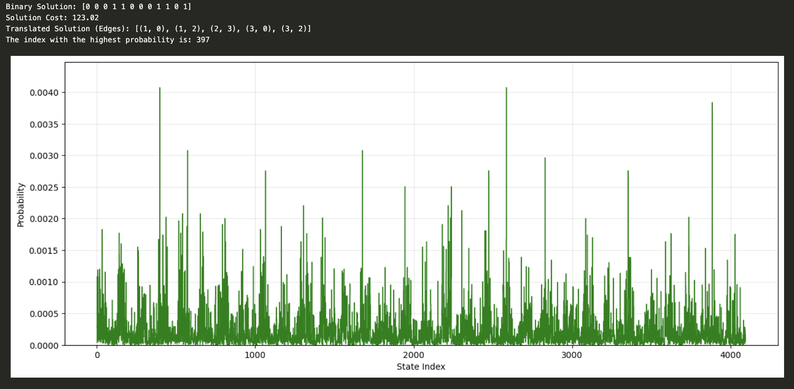

# VRP
Solving the vehicle routing problem using quantum annealing using QAOA

## Installation

To install the required dependencies, run the following command:

```bash
pip install -r requirements.txt
```

## Project Structure

```
vrp_app/
├── myapp/ # Contains Django Web App models, views and templates
├── vrp/ # Contains Django Web App settings and parent urls
├── vrp_classical/   # Contains implementations of classical algorithms for solving the VRP ()
└── vrp_quantum/     # Contains implementations of quantum algorithms for solving the VRP
```

## Running the Website (not yet integrated)

To run run the following commands

```bash
cd vrp_app
```

```bash
./run.sh
```

## Running the Quantum Code

```bash
cd vrp_app
cd vrp_quantum
```
then run the jupyter notebook cell


## Examples to output when running

for Input n = 4, k =2 and 
distance matrix = 
       [[0.00, 36.84, 5.06, 30.63],
        [36.84, 0.00, 24.55, 63.22],
        [5.06, 24.55, 0.00, 15.50],
        [30.63, 63.22, 15.50, 0.00]]: 

Output:


Where the highest probabilities represent the solutions leading to the lowest possible cost, giving cost in this problem of 123.02 while the real optimal cost is 124.871